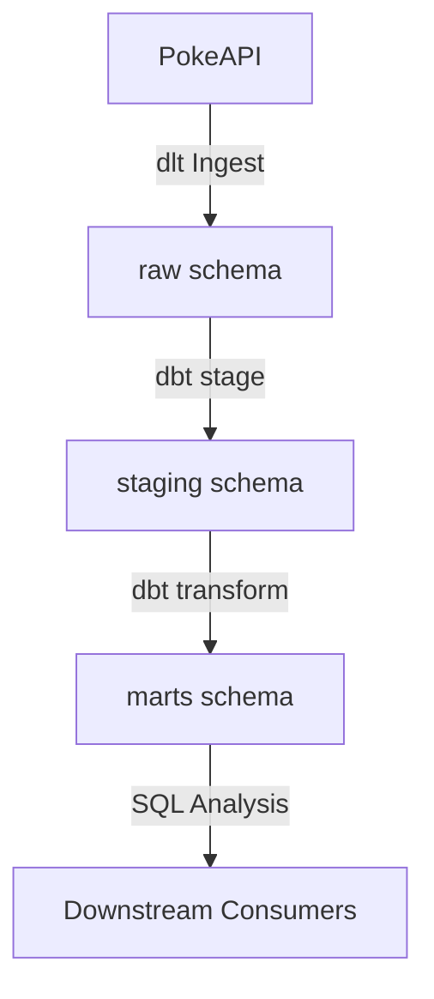

# Product Requirements Document (PRD): Competitive Pokemon Analytics

## 1. Introduction

### Feature Description
This project builds a local-first, reproducible data lakehouse for competitive Pokemon analytics using Python 3.11+, modern open-source frameworks, and a medallion data architecture (Raw → Staging → Marts) on top of a local DuckDB database. 

### Problem it Solves
PokeAPI is a rich, public REST API, but performing bulk analytical operations (e.g., comparing stats across type aggregates, mapping full type-effectiveness matrices, or calculating Same Type Attack Bonuses for all possible movesets) is slow, rate-limited, and difficult to execute directly against REST endpoints. By ingesting this data into a local DuckDB instance and transforming it using dbt, we enable competitive players and data analysts to run fast, complex SQL queries locally to build and optimize team strategies.

### High-Level Goal
Build an automated, robust data pipeline that ingests data from the PokeAPI, handles schema evolution and rate limiting gracefully, transforms raw nested JSON structures into clean analytical models, and provides comprehensive unit and integration testing.

---

## 2. Goals

- **Idempotent Ingestion**: Data must be ingested using dlt's `write_disposition="merge"` with defined primary keys, ensuring pipeline reruns are idempotent and do not duplicate records or cause schema conflicts.
- **Configurable Dev Cycles**: Support rapid local development by allowing a configurable subset of Pokemon (e.g., Gen 1, first 151) via the `POKEMON_LIMIT` environment variable, while keeping full catalogs of moves, abilities, and type-effectiveness data intact.
- **Clean Analytical Schemas**: Present a structured marts layer containing pre-calculated metrics (such as Base Stat Totals, type-average offsets, and STAB-adjusted move power) ready for downstream visualization.
- **High Test Reliability**: Ensure the pipeline and transformation code are verified using standard dbt data quality tests (uniqueness, not-null, referential integrity) and offline-capable pytest integration tests.

---

## 3. User Stories

- **As a competitive Pokemon player**, I want to compare a Pokemon's individual base stats against the average base stats for its primary type, so that I can evaluate its relative advantages (e.g., if a particular Pokemon is faster than typical Grass-types).
- **As a data analyst**, I want a complete, queryable 18x18 matrix of type effectiveness, so that I can calculate defensive weaknesses and offensive type coverage for complex multi-type team configurations.
- **As a team builder**, I want a consolidated view of all learnable moves for each Pokemon along with a STAB (Same Type Attack Bonus) flag and STAB-adjusted power, so that I can select the most damage-efficient movesets.

---

## 4. Functional Requirements

### Feature 1: Data Ingestion (dlt)

- **FR-1.1: Source Endpoints**
  The ingestion pipeline must extract data from the following PokeAPI endpoints:
  - `pokemon`: Detail pages containing base stats, type associations, learnable moves, and abilities.
  - `type`: Damage relations mapping defensive and offensive multipliers.
  - `ability`: Detailed catalog of Pokemon abilities.
  - `move`: Detailed catalog of moves including power, accuracy, type, and damage class.
  - `stat`: Catalog of base stat definitions.

- **FR-1.2: Idempotent Load**
  - Use `write_disposition="merge"` in dlt.
  - Set appropriate `primary_key` constraints (e.g., `id` or `name` fields) for all primary tables.

- **FR-1.3: Schema Evolution & Nesting**
  - Leverage dlt's auto-schema evolution to load nested JSON arrays (e.g., types, stats, moves, abilities) into relational child tables.
  - Do not write manual flattening or pre-processing code in the ingestion script.

- **FR-1.4: Ingestion Limits & POKEMON_LIMIT**
  - Ingestion must respect the `POKEMON_LIMIT` environment variable.
  - If `POKEMON_LIMIT` is set and > 0, the pipeline must only fetch the details of that specified number of Pokemon (e.g., `POKEMON_LIMIT=151` fetches details for Pokemon ID 1 to 151).
  - If `POKEMON_LIMIT` is unset or set to 0, all Pokemon details must be fetched.
  - **Important**: The `POKEMON_LIMIT` controls *only* the Pokemon detail pages. The pipeline must *always* fetch all 18 standard types, all 6 stats, and the complete catalogs of moves and abilities from `/move` and `/ability` to ensure lookup tables remain fully populated.

- **FR-1.5: Streaming & Memory Efficiency**
  - Implement a generator-based resource approach within dlt to stream records sequentially rather than loading full dataset pages into memory.

- **FR-1.6: Pagination**
  - Programmatically follow cursor-based pagination links (`next` URL) for endpoint listings.

- **FR-1.7: Resilience & Rate-Limiting**
  - Gracefully handle HTTP 429 (Too Many Requests) by retrying with exponential backoff.

---

### Feature 2: Data Transformation (dbt)

- **FR-2.1: Staging Layer (`staging` schema)**
  - Create a staging model (`stg_`) for each raw table generated by dlt.
  - Perform type casting (e.g., IDs to integers, string formatting), clean columns, and document standard fields.
  - Keep staging models in a dedicated `staging` schema within the DuckDB database.

- **FR-2.2: Marts Layer (`marts` schema)**
  - **`fct_pokemon_stats`**
    - Pivot raw nested stats from the Pokemon child tables into standard columns: `hp`, `attack`, `defense`, `sp_attack`, `sp_defense`, `speed`.
    - Compute `base_stat_total` (BST) as the sum of the six stats.
    - Identify the primary type of each Pokemon (defined as the type with `slot = 1`).
    - Calculate the average for each of the six stats across all Pokemon sharing that primary type.
    - Output the variance/offset for each Pokemon's stats compared to its primary type's average (e.g., `speed_vs_type_avg = speed - type_avg_speed`).
  - **`dim_type_effectiveness`**
    - Extract damage relationships from the `/type` endpoints.
    - Generate a complete 18x18 matrix representing the standard 18 types (Normal, Fire, Water, Electric, Grass, Ice, Fighting, Poison, Ground, Flying, Psychic, Bug, Rock, Ghost, Dragon, Steel, Dark, Fairy).
    - Rows must consist of `attacking_type`, `defending_type`, and `damage_multiplier` (allowed values: `2.0`, `1.0`, `0.5`, `0.0`).
  - **`fct_competitive_moves`**
    - Perform a join between the Pokemon dataset and all moves they can learn (no filtering out low-power or status moves).
    - Include move features: `move_name`, `move_type`, `power`, `accuracy`, `damage_class` (physical, special, status).
    - Create a boolean `is_stab` (Same Type Attack Bonus) flag, set to `true` if the move's type matches either the Pokemon's primary type (`slot = 1`) or secondary type (`slot = 2`).
    - Calculate `stab_adjusted_power`:
      - If `is_stab` is `true`, return `power * 1.5`.
      - If `is_stab` is `false`, return `power`.
      - For status moves (which have no base power / `power` is NULL), return `NULL`.

- **FR-2.3: Data Validation (dbt tests)**
  - Configure dbt tests in `schema.yml` to assert:
    - Primary key uniqueness and non-null values.
    - Foreign key constraints (e.g., move types map back to valid types).
    - Categorical bounds (e.g., damage multipliers are strictly within `[0.0, 0.5, 1.0, 2.0]`).

---

## 5. Non-Goals

- **Cloud Infrastructure**: Cloud deployments (Google BigQuery) or Terraform orchestration are deferred to a later feature.
- **Workflow Orchestration**: Scheduling/Orchestration via Airflow or Cloud Composer is deferred.
- **Downstream Application**: Building the Streamlit dashboard or user interface is deferred.
- **Dual-Type Effectiveness Computations**: Complex calculations combining defensive multipliers for dual-type Pokemon (e.g., a Fire/Flying Pokemon taking 4x damage from Rock) are out of scope. The single-type 18x18 matrix is sufficient.
- **Detailed Battle Mechanics**: Items, Natures, Effort Values (EVs), Individual Values (IVs), or status condition calculations are not included.

---

## 6. Design Considerations

### Medallion Data Flow

### Relational Schema Layout (DuckDB)
All schemas will reside in the local database file `data/pokedex.db`:
- **`raw`**: Houses raw tables outputted directly by dlt (e.g., `raw.pokemon`, `raw.pokemon__stats`, `raw.pokemon__types`, `raw.move`, etc.).
- **`staging`**: Cleaned, documented, 1-to-1 views representing standard models (`stg_pokemon`, `stg_moves`, `stg_types`).
- **`marts`**: Highly structured tables containing flattened and pre-calculated matrices (`fct_pokemon_stats`, `dim_type_effectiveness`, `fct_competitive_moves`).

---

## 7. Technical Considerations

### Software Requirements
- **Python**: 3.11+
- **Environment & Dependency Manager**: `uv`
- **Primary Dependencies**:
  - `dlt[duckdb]` (data ingestion engine)
  - `dbt-core` & `dbt-duckdb` (data transformation engine)
  - `requests` (HTTP client library for dlt resources)
  - `pytest` & `responses` / `pytest-httpserver` (testing suite)

### Testing Strategy
- Tests must be executable completely offline without communicating with the live PokeAPI.
- Use a dedicated test database: `data/test_pokedex.db`.
- Mock PokeAPI JSON payloads using `responses` or `pytest-httpserver`. Mock fixtures must be stored locally under the `tests/` directory.
- Pytest must validate:
  - Tables are successfully populated in the test DuckDB.
  - Ingestion respects the `POKEMON_LIMIT` configuration (e.g., testing with a limit of 5 Pokemon).
  - Row counts for primary tables are greater than 0.
  - Essential fields (like stats, STAB adjusted power, and damage multipliers) are correctly calculated.

---

## 8. Success Metrics

- **Pipeline Idempotency**: Running the dlt pipeline multiple times on the same target results in zero duplicate rows and no model degradation.
- **Performance**: High-level analytical queries against `marts` tables execute in less than 500ms on the local DuckDB database.
- **Testing Standard**: 100% pass rate on all pytest unit/integration tests and all configured dbt assertions.
- **Coverage**: The `dim_type_effectiveness` matrix contains exactly 324 rows mapping all relationships between the 18 standard types.

---

## 9. Open Questions & Decided Behaviors

- **Q: How does `POKEMON_LIMIT` affect the `fct_competitive_moves` join?**
  - *Decided Behavior*: The moves table will contain the complete catalog of moves, but the Pokemon table will only contain up to the limit (e.g., 151). Thus, `fct_competitive_moves` will correctly only contain the moves learnable by the ingested Pokemon.
- **Q: Are non-standard types (e.g., `unknown`, `shadow`) handled?**
  - *Decided Behavior*: The matrix `dim_type_effectiveness` will filter down strictly to the standard 18 types. Non-standard types present in the API payload will be ignored.
- **Q: What constitutes a primary vs secondary type?**
  - *Decided Behavior*: Pokemon types returned by PokeAPI are ordered. The entry with `slot = 1` is designated as the primary type, and `slot = 2` (if it exists) is the secondary type.
